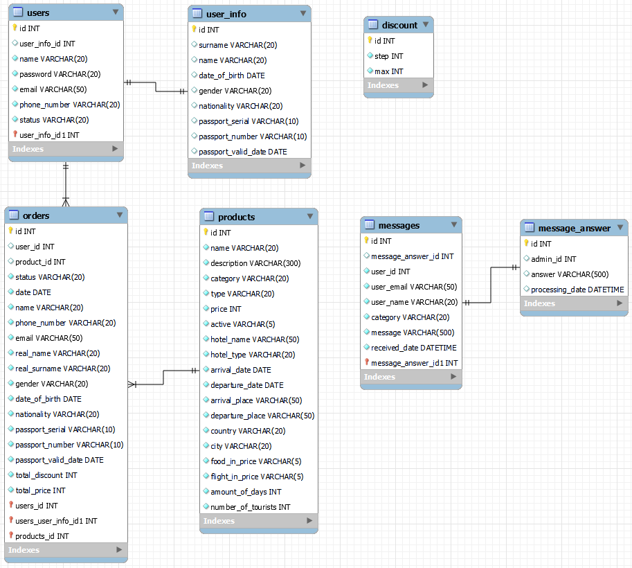

# TravelAgency

The final assignment of the EPAM Java online program.
 
# Task:

The travel agency has a catalog of tours. For the catalog to implement the possibility of
selecting tours:

- by type (rest, excursion, shopping);
- by price;
- by number of persons;
- by hotel type.

The user registers in the system, selects the Tour and makes the Order. After ordering the
tour has the status of registered.
An unregistered user does not have the opportunity to book a tour.
The user has a personal account, which contains brief information about him, as well as a
list of selected tours and their current status (registered, paid, canceled).
The manager defines the tour as hot. Hot tours are always displayed at the top of the list.
The manager transfers the status of the tour from registered to paid or canceled. For each
booked tour, a discount is determined with a step set by the manager, but not more than a
percentage, which is also determined by the manager.

The system administrator has the same rights as the manager, and can additionally:

- add / delete tour, change tour information;
- block / unblock user.

# Implementation requirements:

1. Based on the entities of the subject area, create classes that correspond to them.
2. Classes and methods should have names that reflect their functionality, and should be
   divided into packages.
3. The design of the code must comply with the Java Code Convention.
4. Store information about the subject area in a relational database (as a DBMS
   it is recommended to use MySQL or PostgreSQL).
5. To access data, use the JDBC API using a ready-made or
   self-developed connection pool.
6. The use of ORM frameworks is NOT allowed
7. The application must support work with the Cyrillic alphabet (be multilingual), including at
   storing information in the database:
   a. it should be possible to switch the interface language;
   b. there should be support for input, output and storage of information (in the database),
   recorded in different languages;
   c. choose at least two languages: one based on the Cyrillic alphabet (Ukrainian or Russian),
   the other based on Latin (English).
8. The application architecture should follow the MVC pattern.
9. The use of MVC frameworks is NOT allowed
10. When implementing business logic, it is necessary to use design templates: Team,
    Strategy, Factory, Builder, Singleton, Front Controller, Observer, Adapter, etc.
11. The use of patterns must be justified
12. Using servlets and JSP, implement the functionality given in the statement
    task.
13. Use Apache Tomcat as a servlet container.
14. On JSP pages, apply tags from the JSTL library and developed own tags (minimum: one
    custom tag library tag and one tag file tag).
15. Implement protection against resending data to the server when updating the page
    (implement PRG).
16. When developing, use sessions, filters, listeners.
17. The application must implement authentication and authorization, separation of rights
    access of system users to program components. Password encryption is encouraged.
18. Implement an event log into the project using the log4j library.
19. The code must contain documentation comments (all top-level classes, non-trivial methods
    and constructors).
20. The application must be covered by unit tests (minimum coverage percentage of 40%).
21. Implement a pagination mechanism for pages with data.
22. All input fields must have data validation.
23. The application must respond correctly to errors and exceptional situations of various kinds (final
    the user should not see the stack trace on the client side).

All tasks are completed.

# Additionally added:

- OTP functionality via email for password recovery;
- Support system;
- Error/Warning alerts;
- Password hashing;
- Leader role.

# MySQL er-diagram:
